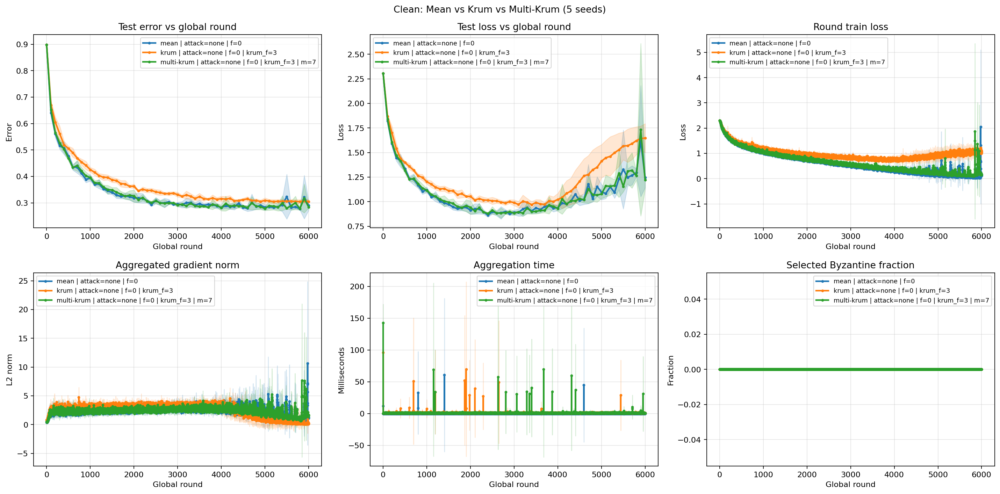
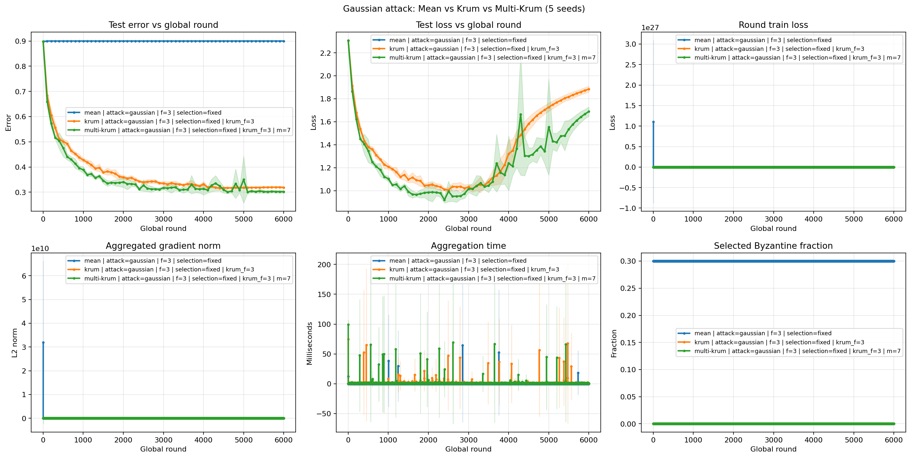
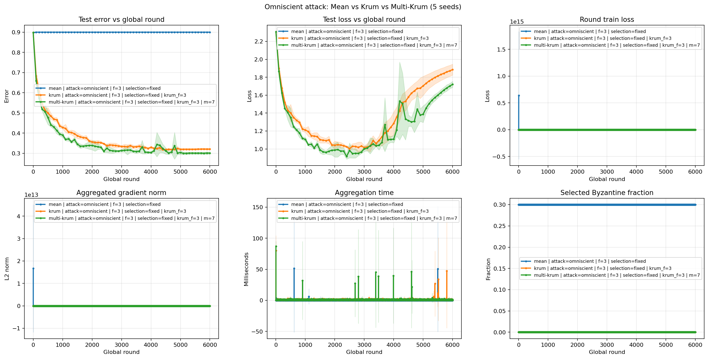
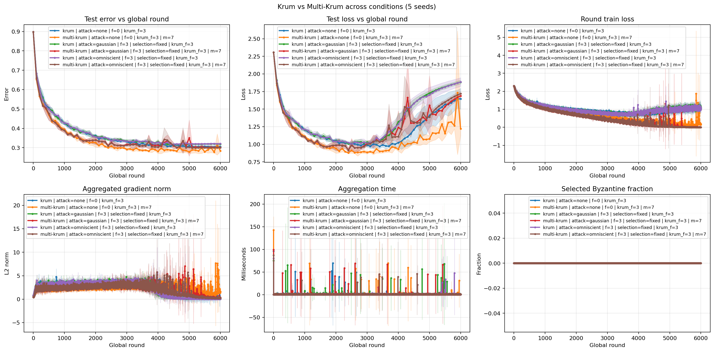

# Krum CIFAR-10 复现实验报告

## 1. 项目概述

本项目复现论文 **Machine Learning with Adversaries: Byzantine Tolerant Gradient Descent** 中的 Byzantine-robust 梯度聚合思想，并将其应用到 CIFAR-10 图像分类任务。

项目没有搭建真实的多进程或多机器集群，而是在单个 Python 进程中串行模拟 10 个 worker。每一轮中，10 个 worker 都基于同一个全局模型分别计算梯度，parameter server 收集这些梯度后使用 Mean、Krum 或 Multi-Krum 聚合，并且只对全局模型更新一次。

当前已经完成：

- CIFAR-10 单机训练 baseline；
- 10-worker 串行同步 SGD；
- Mean、Krum 和 Multi-Krum 聚合；
- Gaussian attack；
- Omniscient 反向梯度攻击的实验化实现；
- 固定或随机 Byzantine worker 选择；
- CSV/JSONL 实验记录；
- 多 seed、并发批量实验；
- 多组实验结果解析和可视化。

本报告基于已经完成的 5 个随机种子、9 种配置，共 45 次训练结果。每次训练运行 6000 个 global rounds。

> 说明：本项目复现的是论文核心机制和定性现象，不是对论文数据集、网络结构和所有超参数的逐项精确复刻。

---

## 2. 论文中的系统模型与本项目对应关系

论文将第 \(t\) 轮训练写为：

\[
x_{t+1} = x_t - \gamma_t F(V_1^t, \ldots, V_n^t)
\]

其中：

- \(x_t\)：第 \(t\) 轮开始时的全局模型参数；
- \(\gamma_t\)：学习率；
- \(V_i^t\)：worker \(i\) 基于当前模型计算出的梯度估计；
- \(F\)：服务器使用的梯度聚合规则；
- \(x_{t+1}\)：聚合并更新后的全局模型。

本项目中的代码对应如下：

| 论文概念 | 项目实现 |
|---|---|
| 全局模型 \(x_t\) | `SimpleCNN` 的参数 |
| worker 梯度 \(V_i^t\) | `compute_worker_gradient(...)` 返回的一维梯度 |
| 聚合规则 \(F\) | `mean_aggregate`、`krum_aggregate`、`multi_krum_aggregate` |
| Byzantine worker | `attacks.py` 修改后的 worker 梯度 |
| 参数更新 | 将聚合梯度写入 `param.grad`，再调用 `optimizer.step()` |
| 一轮训练 | `train_distributed.py` 中一次 global round |

一个 global round 的数据流为：

```text
当前全局模型 x_t
    |
10 个 worker 分别读取自己的一个 mini-batch
    |
每个 worker 基于同一个 x_t 串行执行 forward 和 backward
    |
得到 10 个一维梯度向量
    |
可选：将指定 worker 的梯度替换为恶意梯度
    |
Mean / Krum / Multi-Krum 聚合
    |
聚合梯度写回全局模型的 param.grad
    |
optimizer.step() 只执行一次
    |
得到 x_(t+1)
```

这里的“串行”只表示程序逐个计算 worker 梯度，不会改变同步 SGD 的语义。因为在服务器更新前，所有 worker 使用的模型参数完全相同。

---

## 3. 实验环境

实验环境如下：

| 项目 | 配置 |
|---|---|
| 操作系统 | WSL2 / Linux |
| Conda 环境 | `krum` |
| Python | 3.10.20 |
| PyTorch | 2.11.0+cu128 |
| torchvision | 0.26.0+cu128 |
| PyTorch CUDA runtime | CUDA 12.8 |
| GPU | NVIDIA GeForce RTX 4070 Ti SUPER |
| 数据集 | CIFAR-10 |

基础环境启用方式：

```bash
conda activate krum
```

CIFAR-10 数据放在 `~/datasets/cifar10`，仓库中的 `data` 是指向该位置的软链接。这样原始数据和训练生成的实验结果都不需要进入 Git。

---

## 4. 仓库结构与代码职责

当前核心文件的职责如下：

| 文件 | 主要职责 |
|---|---|
| [data.py](data.py) | 加载 CIFAR-10；生成 baseline loader；将训练集 IID 划分给 10 个 worker |
| [model.py](model.py) | 定义 `SimpleCNN` |
| [train_baseline.py](train_baseline.py) | 普通单模型 CIFAR-10 baseline |
| [distributed.py](distributed.py) | worker 梯度计算、梯度展平/写回、Mean/Krum/Multi-Krum |
| [attacks.py](attacks.py) | Gaussian attack 和 Omniscient attack |
| [train_distributed.py](train_distributed.py) | 10-worker 串行同步训练主流程 |
| [experiment_logger.py](experiment_logger.py) | 记录配置、round 指标、evaluation 指标和最终摘要 |
| [plot_results.py](plot_results.py) | 解析一个或多个实验目录，跨 seed 聚合并生成图表 |
| [run_experiments.sh](run_experiments.sh) | 按任务列表和 seed 批量并发运行实验 |
| [requirements.txt](requirements.txt) | 当前直接 Python 依赖 |
| [README.md](README.md) | 环境、运行方式和常用实验命令 |
| [论文 PDF](docs/NIPS-2017-machine-learning-with-adversaries-byzantine-tolerant-gradient-descent-Paper.pdf) | 原论文 |

实验原始记录保存在 `results/`，该目录不进入 Git。报告使用的图表保存在 `docs/figures/`。

---

## 5. 数据与模型

### 5.1 CIFAR-10 数据处理

训练集包含 50000 张图像，测试集包含 10000 张图像。输入图像执行：

1. `ToTensor`；
2. 按 CIFAR-10 通道统计量归一化；
3. 不使用随机裁剪、翻转等数据增强。

普通 baseline 使用完整训练集。分布式实验使用固定 seed 随机打乱样本索引，再把训练集尽量均匀地分成 10 份：

\[
D = D_1 \cup D_2 \cup \cdots \cup D_{10}
\]

每个 worker 得到约 5000 个样本。当前划分是随机 IID 划分，不是 non-IID 联邦学习划分。

每个 worker 的默认 batch size 为 50。因此 Mean 每轮等价地利用约 500 个样本的梯度信息；Krum 每轮最终只保留一个 worker 的梯度；Multi-Krum 在当前配置下平均 7 个被选中的 worker 梯度。

### 5.2 SimpleCNN

模型结构为：

```text
输入: 3 x 32 x 32
Conv2d(3, 32, kernel_size=3, padding=1)
ReLU
MaxPool2d(2)
Conv2d(32, 64, kernel_size=3, padding=1)
ReLU
MaxPool2d(2)
Flatten
Linear(64 * 8 * 8, 128)
ReLU
Linear(128, 10)
```

该模型结构简单，没有 BatchNorm、Dropout、复杂 scheduler 或残差模块，便于直接观察不同聚合规则对训练的影响。

---

## 6. 梯度计算与参数更新

### 6.1 worker 梯度计算

`compute_worker_gradient(...)` 对一个 worker 的一个 mini-batch 执行：

```python
model.zero_grad()
outputs = model(inputs)
loss = criterion(outputs, targets)
loss.backward()
flat_gradient = flatten_gradients(model)
```

worker 不调用 `optimizer.step()`，因此它不会独立修改全局模型。

每次计算前都会清空模型梯度。`backward()` 只把当前 mini-batch 的梯度写入各参数的 `.grad`。随后代码立即复制并展平梯度，因此下一个 worker 的计算不会覆盖已经保存的向量。

### 6.2 梯度展平

神经网络各层参数形状不同，而 Krum 需要把每个 worker 梯度视为同一个 \(d\) 维向量：

\[
V_i \in \mathbb{R}^d
\]

代码按模型参数顺序执行：

```python
flat_gradient = torch.cat([
    parameter.grad.detach().reshape(-1)
    for parameter in model.parameters()
])
```

10 个 worker 梯度堆叠后形成：

\[
G \in \mathbb{R}^{10 \times d}
\]

其中每一行对应一个 worker。

### 6.3 聚合梯度写回模型

聚合器返回一个长度为 \(d\) 的一维向量。`assign_flat_gradient(...)` 按与展平时完全相同的参数顺序切片，将各段恢复为原参数形状并赋给 `parameter.grad`。

随后调用：

```python
optimizer.step()
```

因此每个 global round 中，全局模型只更新一次。

---

## 7. 三种聚合算法

### 7.1 Mean

Mean 直接计算所有 worker 梯度的算术平均：

\[
g_{\text{mean}} = \frac{1}{n}\sum_{i=1}^{n}V_i
\]

代码核心等价于：

```python
worker_gradients.mean(dim=0)
```

没有攻击时，Mean 通常能最充分地利用所有 worker 的数据；存在幅值很大的恶意梯度时，少量 Byzantine worker 就可能完全控制平均结果。

### 7.2 Krum

Krum 不直接平均所有梯度。对每个候选梯度 \(V_i\)，它计算该梯度与其他梯度之间的平方欧氏距离，并找出距离最近的 \(n-f-2\) 个邻居：

\[
s(i) =
\sum_{j \in N_i}
\lVert V_i - V_j \rVert_2^2
\]

其中 \(N_i\) 是 \(V_i\) 最近的 \(n-f-2\) 个其他梯度。Krum 选择分数最小的一个梯度：

\[
i^* = \arg\min_i s(i)
\]

\[
g_{\text{Krum}} = V_{i^*}
\]

本实验使用：

- \(n=10\)；
- \(f=3\)；
- 邻居数 \(n-f-2=5\)。

代码会验证论文要求的容错条件：

\[
2f+2<n
\]

Krum 每轮只保留一个 worker 梯度，因此与 Mean 相比方差更大、有效 batch 更小。在没有攻击时，它略慢或精度略低是合理现象，而不是实现错误。

### 7.3 Multi-Krum

Multi-Krum 使用与 Krum 相同的 score，但不只选择一个 worker。它选择分数最小的 \(m\) 个梯度并求平均：

\[
S = \text{indices of the }m\text{ smallest Krum scores}
\]

\[
g_{\text{Multi-Krum}} =
\frac{1}{m}\sum_{i\in S}V_i
\]

当前默认：

\[
m=n-f=7
\]

Multi-Krum 保留 Krum 的距离筛选机制，同时平均多个可信梯度，通常比单 Krum 方差更低、训练更接近干净 Mean。

---

## 8. Byzantine 攻击

当前实验固定把 worker 0、1、2 设为 Byzantine worker，即：

- worker 总数：10；
- Byzantine worker 数：3；
- Byzantine 比例：30%。

代码也支持每轮随机选择恶意 worker，但本报告的标准对比统一使用 `fixed`，避免恶意集合变化成为额外变量。

攻击发生在诚实 worker 梯度全部计算完成之后、聚合之前：

```text
计算 10 个原始 worker 梯度
    |
复制梯度矩阵
    |
替换 Byzantine worker 对应的行
    |
将修改后的梯度矩阵交给聚合器
```

### 8.1 Gaussian attack

Gaussian attack 将恶意 worker 梯度替换为独立高斯噪声：

\[
V_{\text{malicious}} \sim \mathcal{N}(0, 200^2 I)
\]

当前默认标准差为 200，与正常神经网络梯度相比幅值极大。这是论文实验使用的简单破坏方式之一。

Mean 会无条件接收恶意值，因此很快发散；Krum 和 Multi-Krum 可以利用正常梯度在几何空间中彼此接近这一特征，将高斯异常值排除。

### 8.2 Omniscient attack

项目中的 Omniscient attack 先计算当前轮诚实梯度的平均值：

\[
\bar{g}_{\text{honest}}
=
\frac{1}{n-f}
\sum_{i \in \text{honest}}V_i
\]

再让所有 Byzantine worker 提交方向相反、幅值放大的梯度：

\[
V_{\text{malicious}}
=
-\lambda\bar{g}_{\text{honest}}
\]

当前默认 \(\lambda=100\)。

该攻击模拟“攻击者知道诚实更新方向，并尝试让模型向反方向移动”。它对应论文 omniscient adversary 的核心思路，但并非论文实验的逐项精确实现：论文中的攻击者可以使用整个训练集估计更准确的真实梯度，而本项目使用当前轮正常 worker 梯度的平均值。因此报告把它称为论文攻击思想在当前 10-worker CIFAR-10 框架中的实现化近似。

---

## 9. 优化器与训练设置

分布式训练使用 SGD：

```python
optimizer = torch.optim.SGD(model.parameters(), lr=0.05)
```

标准实验配置为：

| 参数 | 数值 |
|---|---:|
| global rounds | 6000 |
| worker 数 | 10 |
| 每 worker batch size | 50 |
| learning rate | 0.05 |
| optimizer | SGD |
| evaluation interval | 100 rounds |
| Byzantine worker 数 | 0 或 3 |
| Multi-Krum \(m\) | 7 |
| seed | 0、1、2、3、4 |
| 数据增强 | 无 |
| scheduler | 无 |

此前实验表明当前设置通常在约 6000 global rounds 附近进入基本收敛区间。由于学习率固定且没有 scheduler，后期指标可能出现震荡，不能把单个最后 evaluation point 当作唯一结论。

---

## 10. 实验记录系统

每次运行会创建一个独立结果目录，并保存：

| 文件 | 内容 |
|---|---|
| `config.json` | 聚合器、攻击、seed、worker 数和超参数 |
| `rounds.csv` | 每轮训练 loss、梯度 norm、聚合时间等 |
| `metrics.csv` | 定期评估的 train/test loss 与 accuracy |
| `aggregation.jsonl` | Krum/Multi-Krum 选择结果和 Byzantine 命中情况 |
| `summary.json` | 完成状态、最终指标、总耗时等摘要 |

`results/` 已被 Git 忽略，因此大量原始实验数据不会进入版本控制。图表解析脚本可以接受多个结果目录，并在配置相同但 seed 不同的情况下按 evaluation round 对齐，绘制均值和一个标准差阴影。

记录系统使后续实验能够回答以下问题：

- Mean 在攻击下何时开始发散；
- Krum/Multi-Krum 是否选中过恶意 worker；
- 相同配置在不同 seed 下波动多大；
- 干净训练和攻击训练之间的准确率差距；
- 单 Krum 与 Multi-Krum 的收敛速度差异；
- 聚合算法自身的耗时。

需要注意：本轮批量实验允许多个任务共享一张 GPU 并发运行，所以 aggregation time 和 wall-clock time 受到进程竞争影响，不能作为严格的算法速度比较。

---

## 11. 实验矩阵

每个 seed 都运行以下 9 种配置：

| 聚合器 | 无攻击 | Gaussian | Omniscient |
|---|---:|---:|---:|
| Mean | 是 | 是 | 是 |
| Krum | 是 | 是 | 是 |
| Multi-Krum | 是 | 是 | 是 |

5 个 seeds 共得到：

\[
3 \times 3 \times 5 = 45
\]

次实验。

批量运行入口：

```bash
conda activate krum
bash run_experiments.sh
```

脚本中的 `SEEDS` 控制随机种子列表，`MAX_JOBS` 控制最大并发任务数，`EXPERIMENTS` 列表控制要运行的配置。

---

## 12. 主要实验结果

### 12.1 第 6000 轮测试准确率

下表为 5 个 seed 在第 6000 global round 的平均测试准确率和总体标准差：

| 聚合器 | 攻击 | Test Accuracy |
|---|---|---:|
| Mean | None | 71.040% ± 1.825% |
| Krum | None | 69.466% ± 0.799% |
| Multi-Krum | None | 71.580% ± 0.355% |
| Mean | Gaussian | 10.000% ± 0.000% |
| Krum | Gaussian | 68.086% ± 0.342% |
| Multi-Krum | Gaussian | 69.810% ± 0.509% |
| Mean | Omniscient | 10.000% ± 0.000% |
| Krum | Omniscient | 67.914% ± 0.401% |
| Multi-Krum | Omniscient | 69.948% ± 0.489% |

CIFAR-10 随机猜测准确率为 10%。因此两个攻击下的 Mean 已完全失效，而 Krum 和 Multi-Krum 仍能正常学习。

### 12.2 不同训练阶段的准确率

| 聚合器 / 攻击 | Round 1000 | Round 4000 | Round 6000 |
|---|---:|---:|---:|
| Mean / None | 60.514% | 71.780% | 71.040% |
| Krum / None | 57.444% | 68.424% | 69.466% |
| Multi-Krum / None | 60.466% | 71.888% | 71.580% |
| Mean / Gaussian | 10.000% | 10.000% | 10.000% |
| Krum / Gaussian | 57.210% | 66.846% | 68.086% |
| Multi-Krum / Gaussian | 61.110% | 68.626% | 69.810% |
| Mean / Omniscient | 10.000% | 10.000% | 10.000% |
| Krum / Omniscient | 57.272% | 67.078% | 67.914% |
| Multi-Krum / Omniscient | 61.042% | 69.636% | 69.948% |

表中数值均为 5 个 seed 的均值。它显示：

1. Krum 的干净训练比 Mean 慢，符合其每轮只采用一个梯度、方差更大的特点；
2. Multi-Krum 的干净训练几乎达到 Mean 的速度与精度；
3. 两种攻击会让 Mean 从训练早期就完全失效；
4. Krum 与 Multi-Krum 在攻击下仍持续收敛；
5. Multi-Krum 整体比单 Krum 高约 1 至 2 个百分点。

### 12.3 峰值与后期窗口

各 seed 的最高测试准确率再取平均：

| 聚合器 | 攻击 | 平均峰值 Test Accuracy |
|---|---|---:|
| Mean | None | 72.566% ± 0.366% |
| Krum | None | 69.730% ± 0.739% |
| Multi-Krum | None | 72.758% ± 0.569% |
| Mean | Gaussian | 10.000% ± 0.000% |
| Krum | Gaussian | 68.438% ± 0.307% |
| Multi-Krum | Gaussian | 70.302% ± 0.477% |
| Mean | Omniscient | 10.000% ± 0.000% |
| Krum | Omniscient | 68.358% ± 0.445% |
| Multi-Krum | Omniscient | 70.308% ± 0.476% |

最后 1000 rounds 内各 seed 的 evaluation accuracy 先求平均，再跨 seed 汇总：

| 聚合器 | 攻击 | 后 1000 rounds 平均 Test Accuracy |
|---|---|---:|
| Mean | None | 70.830% ± 1.037% |
| Krum | None | 69.385% ± 0.618% |
| Multi-Krum | None | 71.041% ± 0.906% |
| Krum | Gaussian | 68.078% ± 0.251% |
| Multi-Krum | Gaussian | 69.310% ± 1.173% |
| Krum | Omniscient | 67.975% ± 0.402% |
| Multi-Krum | Omniscient | 69.939% ± 0.595% |

后期窗口比“最后一个点”更能抵抗固定学习率造成的短暂波动。无论使用第 6000 轮、峰值还是后期窗口，核心结论保持一致。

### 12.4 攻击相对干净训练的影响

在第 6000 轮，攻击相对于同一聚合器干净训练的准确率变化为：

| 聚合器 | Gaussian gap | Omniscient gap |
|---|---:|---:|
| Krum | -1.380 ± 0.720 个百分点 | -1.552 ± 0.847 个百分点 |
| Multi-Krum | -1.770 ± 0.562 个百分点 | -1.632 ± 0.477 个百分点 |

这说明攻击仍会带来小幅性能代价，但没有破坏训练闭环。相比 Mean 从约 71% 直接跌到 10%，Krum 系列聚合器表现出明显的 Byzantine robustness。

---

## 13. 聚合器是否选中了 Byzantine worker

实验日志记录了每轮的选择结果。

Gaussian attack：

| 聚合器 | Byzantine selected | 总选择次数 | 比例 |
|---|---:|---:|---:|
| Mean | 90000 | 300000 | 30.0% |
| Krum | 0 | 30000 | 0.0% |
| Multi-Krum | 0 | 210000 | 0.0% |

Omniscient attack：

| 聚合器 | Byzantine selected | 总选择次数 | 比例 |
|---|---:|---:|---:|
| Mean | 90000 | 300000 | 30.0% |
| Krum | 0 | 30000 | 0.0% |
| Multi-Krum | 0 | 210000 | 0.0% |

总数来自 5 个 seed：

- Mean 每轮使用全部 10 个梯度；
- Krum 每轮选择 1 个梯度；
- Multi-Krum 每轮选择 7 个梯度；
- 每个配置运行 6000 轮。

在当前攻击强度和数据设置下，Krum 与 Multi-Krum 在 5 个 seeds、两种攻击的所有轮次中都没有选中恶意 worker。这直接解释了为什么它们在攻击下仍能保持接近干净训练的准确率。

---

## 14. 可视化结果

### 14.1 无攻击对比



无攻击时，Mean 和 Multi-Krum 的学习速度与最终误差相近；单 Krum 收敛更慢、最终误差略高。该现象符合三种聚合器实际使用梯度数量的差异。

### 14.2 Gaussian attack



Mean 在训练早期即退化为随机猜测。Krum 和 Multi-Krum 能持续降低 test error，其中 Multi-Krum 通常优于单 Krum。

由于 Mean 的梯度 norm 和 loss 在攻击后迅速变为极大值或非有限值，图中对应面板的纵轴会被 Mean 主导，Krum 和 Multi-Krum 曲线因此看起来被压缩在底部。test error 和 Byzantine selected fraction 是这张图最直观的关键指标。

### 14.3 Omniscient attack



Omniscient attack 下的现象与 Gaussian attack 一致：Mean 完全失效，而 Krum 和 Multi-Krum 保持有效学习。Multi-Krum 的测试误差仍低于单 Krum。

### 14.4 鲁棒聚合器综合对比



该图只比较 Krum 和 Multi-Krum 在无攻击、Gaussian 和 Omniscient 三种条件下的结果。两种鲁棒聚合器受攻击后的曲线均接近各自干净曲线；Multi-Krum 在多数阶段具有更低的 test error。

图中实线为相同配置下 5 个 seed 的均值，阴影为一个总体标准差。

---

## 15. 与论文实验现象的对应

论文 Section 6 主要展示了以下结论：

1. 在 Gaussian Byzantine worker 存在时，普通平均会失败；
2. Krum 能在相同攻击下保持学习；
3. Krum 的鲁棒性存在统计效率代价，需要更大的有效 batch 或更多迭代；
4. Multi-Krum 通过平均多个低分梯度改善单 Krum 的效率；
5. 面对知道正确梯度方向的 omniscient adversary，普通平均容易被反向大向量控制，而 Krum 能拒绝异常梯度。

本项目观察到：

| 论文现象 | 当前结果 | 判断 |
|---|---|---|
| Gaussian 使 Mean 失败 | Mean 准确率固定在 10% | 符合 |
| Krum 抵抗 Gaussian | 第 6000 轮为 68.086% | 符合 |
| 干净 Krum 比干净 Mean 效率低 | 69.466% 对 71.040%，早期也更慢 | 符合 |
| Multi-Krum 改善 Krum | 干净与攻击条件均高于单 Krum | 符合 |
| 反方向强攻击破坏 Mean | Mean 准确率固定在 10% | 符合 |
| Krum 抵抗反方向攻击 | Krum 67.914%，Multi-Krum 69.948% | 符合 |
| 鲁棒聚合器排除明显恶意梯度 | 所有攻击轮次 Byzantine selected fraction 为 0 | 符合 |

因此，这组结果可以被视为对论文核心结论的合理定性复现。

它不能被称为论文数值结果的精确复现，原因包括：

- 论文部分实验使用 Spambase 和 MNIST，本项目使用 CIFAR-10；
- 网络结构不同；
- 论文实验 worker 数和 Byzantine 比例并不都等于本项目的 10 和 3；
- 本项目每 worker batch size 为 50，而论文部分图使用更小 batch；
- 本项目的 Omniscient attack 使用当前轮诚实梯度均值，不是全训练集梯度；
- 本项目尚未复现论文中的 batch-size cost of resilience 扫描；
- 本项目是单进程串行模拟，不测量真实分布式通信成本。

---

## 16. 数值稳定性与异常观察

### 16.1 Mean 在攻击下的非有限梯度

Gaussian attack 下，5 个 seed 首次出现非有限聚合梯度的 round 分别为：

```text
4, 4, 5, 4, 5
```

Omniscient attack 下均在 round 5 首次出现：

```text
5, 5, 5, 5, 5
```

之后 Mean 的测试准确率维持在 10%。这不是绘图器错误，而是大幅恶意梯度反复通过 Mean 聚合后造成的真实数值发散。

### 16.2 固定学习率造成的后期震荡

部分干净或鲁棒实验在 4000 至 6000 rounds 之间出现短暂准确率下降，随后恢复。例如个别 Multi-Krum Gaussian run 在一个 evaluation point 明显下降，下一个 evaluation point 又恢复到约 69%。

查看 round 级日志时，同期存在梯度 norm 和训练 loss 的短时尖峰。由于：

- 学习率始终为 0.05；
- 没有 scheduler；
- 没有数据增强；
- Krum 的选择具有额外随机方差；

这种后期震荡是可解释的。报告因此同时给出固定 round、峰值和后期窗口统计，不依赖单个最好或最后点得出结论。

---

## 17. 复现实验命令

### 17.1 单次训练

无攻击 Mean：

```bash
python train_distributed.py \
  --aggregator mean \
  --attack none \
  --num-workers 10 \
  --epochs 60 \
  --batch-size 50 \
  --learning-rate 0.05 \
  --eval-interval-rounds 100 \
  --seed 0
```

Gaussian attack + Krum：

```bash
python train_distributed.py \
  --aggregator krum \
  --krum-f 3 \
  --attack gaussian \
  --num-byzantine 3 \
  --byzantine-selection fixed \
  --num-workers 10 \
  --epochs 60 \
  --batch-size 50 \
  --learning-rate 0.05 \
  --eval-interval-rounds 100 \
  --seed 0
```

Gaussian attack + Multi-Krum：

```bash
python train_distributed.py \
  --aggregator multi-krum \
  --krum-f 3 \
  --multi-krum-m 7 \
  --attack gaussian \
  --num-byzantine 3 \
  --byzantine-selection fixed \
  --num-workers 10 \
  --epochs 60 \
  --batch-size 50 \
  --learning-rate 0.05 \
  --eval-interval-rounds 100 \
  --seed 0
```

Omniscient attack 只需将攻击参数改为：

```bash
--attack omniscient --attack-scale 100
```

### 17.2 批量运行 5 个 seeds

编辑 [run_experiments.sh](run_experiments.sh)：

```bash
SEEDS=(0 1 2 3 4)
MAX_JOBS=6
```

再运行：

```bash
bash run_experiments.sh
```

`MAX_JOBS` 只控制并发进程数，不改变每个实验的算法语义。但多个进程共享 GPU 时会改变运行时间，因此吞吐量和 aggregation time 不应与串行结果直接比较。

### 17.3 重新生成本报告图表

以下路径模式只选择 seed 0 至 4 的标准 6000-round 实验。实际目录名以 `results/` 中记录为准。

无攻击图：

```bash
python plot_results.py \
  results/????????_??????_??????_mean-clean-6000rounds-seed[0-4] \
  results/????????_??????_??????_krum-clean-f3-6000rounds-seed[0-4] \
  results/????????_??????_??????_multi-krum-clean-f3-m7-6000rounds-seed[0-4] \
  --aggregate-seeds \
  --output docs/figures/clean-five-seeds.png
```

Gaussian 图：

```bash
python plot_results.py \
  results/????????_??????_??????_mean-gaussian-f3-fixed-6000rounds-seed[0-4] \
  results/????????_??????_??????_krum-gaussian-f3-fixed-6000rounds-seed[0-4] \
  results/????????_??????_??????_multi-krum-gaussian-f3-fixed-m7-6000rounds-seed[0-4] \
  --aggregate-seeds \
  --output docs/figures/gaussian-five-seeds.png
```

Omniscient 图：

```bash
python plot_results.py \
  results/????????_??????_??????_mean-omniscient-f3-fixed-scale100-6000rounds-seed[0-4] \
  results/????????_??????_??????_krum-omniscient-f3-fixed-scale100-6000rounds-seed[0-4] \
  results/????????_??????_??????_multi-krum-omniscient-f3-fixed-m7-scale100-6000rounds-seed[0-4] \
  --aggregate-seeds \
  --output docs/figures/omniscient-five-seeds.png
```

Krum 与 Multi-Krum 在三种条件下的综合图：

```bash
python plot_results.py \
  results/????????_??????_??????_krum-clean-f3-6000rounds-seed[0-4] \
  results/????????_??????_??????_multi-krum-clean-f3-m7-6000rounds-seed[0-4] \
  results/????????_??????_??????_krum-gaussian-f3-fixed-6000rounds-seed[0-4] \
  results/????????_??????_??????_multi-krum-gaussian-f3-fixed-m7-6000rounds-seed[0-4] \
  results/????????_??????_??????_krum-omniscient-f3-fixed-scale100-6000rounds-seed[0-4] \
  results/????????_??????_??????_multi-krum-omniscient-f3-fixed-m7-scale100-6000rounds-seed[0-4] \
  --aggregate-seeds \
  --output docs/figures/robust-aggregators-five-seeds.png
```

如目录命名规则发生变化，应先用以下命令确认路径，避免 glob 混入不同超参数实验：

```bash
find results -maxdepth 2 -name config.json | sort
```

---

## 18. 可复现性限制

结果目录中的配置审计显示：

- seed 0 的部分早期 clean run 来自较早 commit；
- 其余标准实验来自加入 Omniscient attack 后的 commit；
- 两个版本之间对 clean/Gaussian 核心训练和聚合逻辑没有实质修改；
- 部分运行记录的 `git_dirty` 为 true。

因此现有结果足以支持当前机制验证和定性结论，但如果要发布为严格、可审计的论文级复现结果，建议：

1. 将最终代码整理并提交到一个固定 commit；
2. 确保 `git status` 干净；
3. 在该 commit 上重新运行完整 5-seed 实验矩阵；
4. 保存 commit hash、环境版本和完整命令；
5. 再补充不同 batch size、不同 \(f\)、攻击强度和更多 seeds 的置信区间实验。

---

## 19. 当前结论

本项目已经完成 Krum 论文核心训练机制的可运行复现：

- 无攻击时，Mean 和 Multi-Krum 表现接近，单 Krum 因只采用一个梯度而略慢；
- Gaussian 和反向 Omniscient 攻击均能让 Mean 迅速发散到随机猜测水平；
- Krum 与 Multi-Krum 在同样攻击下保持约 68% 至 70% 的测试准确率；
- 所有标准攻击实验中，Krum 和 Multi-Krum 都没有选择 Byzantine worker；
- Multi-Krum 兼顾了异常梯度筛选和多梯度平均，整体优于单 Krum；
- 这些结果与论文关于 Mean 脆弱性、Krum Byzantine resilience 和 Multi-Krum 效率改进的核心结论一致。

当前成果属于“核心算法和定性实验现象复现”。若要进一步完成更严格的论文复现，还需要统一干净 commit 重跑、扩大统计规模，并补充论文中的 batch-size cost of resilience 等控制变量实验。
